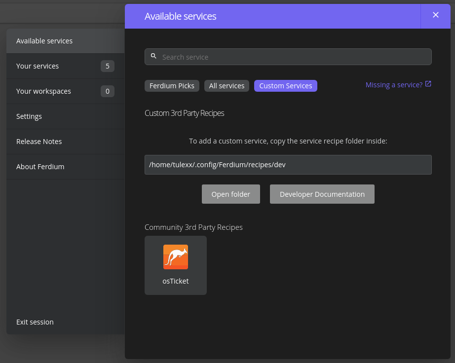

# osTicket for Ferdium

Unofficial osTicket recipe for Ferdium

### Release notes
* 1.0.0: First version

### Usage
1. Install [Ferdium](https://ferdium.org/)
2. Create a dev folder in:
    * Mac: ~/Library/Application Support/Ferdium/recipes/
    * Windows: %appdata%/Ferdium/recipes/
    * Linux: ~/.config/Ferdium/recipes/
3. Download this repository to a folder osticket in dev
4. Restart Ferdium
5. Add new service (ctrl+n) and under "Custom Services" you should see osTicket

6. Click it and under "Custom server" paste the address for your instance
7. Log in and use :)

### How to create your own Ferdium recipes:
[Read the documentation](https://github.com/ferdium/ferdium-recipes/blob/main/docs/integration.md)